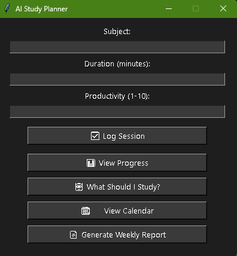
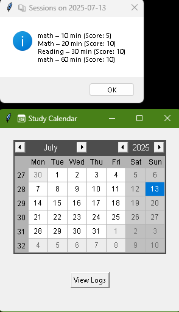
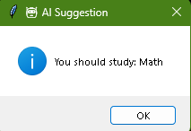

````markdown
# 🧠 AI Study Planner

A Python-based study tracking app with a modern GUI, AI-powered subject suggestions, a study calendar, and weekly PDF progress reports.

---

## 🚀 Features

- ✅ Log study sessions (subject, time, productivity)
- 📊 View analytics (bar graphs, time spent per subject)
- 🤖 AI suggests what to study next based on your data
- 📅 Calendar view with clickable days to review sessions
- 📄 Weekly PDF reports summarizing your productivity
- 🎨 Dark-mode themed modern GUI

---

## 📸 Screenshots

### Main App


### Calendar View


### AI Suggestion



---

## 🛠 Tech Stack

- **Python 3**
- `tkinter` (GUI)
- `pandas` (data analysis)
- `matplotlib` (graphs)
- `tkcalendar` (calendar view)
- `reportlab` (PDF reports)

---

## 📂 How to Run

---

## 1. Clone the repository

```bash
git clone https://github.com/YOUR_USERNAME/ai-study-planner.git
cd ai-study-planner
````

---

## 2. Create and activate a virtual environment

On Windows:

```bash
python -m venv venv
.\venv\Scripts\activate
```

On Mac/Linux:

```bash
python3 -m venv venv
source venv/bin/activate
```

---

## 3. Install Required Packages

Make sure your virtual environment is activated, then run:

```bash
pip install -r requirements.txt
```

---

## 4. Run the App

```bash
python gui.py
```

---

## 📄 PDF Weekly Reports

Click **“📄 Generate Weekly Report”** in the app to export a professional summary with:

* Total minutes studied
* Average productivity score
* Most studied subject
* AI-generated recommendation for next focus

---

## 👤 Author

**Devaughn Henry**
16-year-old aspiring Computer Engineer focused on Python, automation, and AI development.
This project was built to strengthen my portfolio and demonstrate real-world coding skills.

---

## 🔮 Future Additions

* Email/Discord study reminders
* Flashcard integration
* Streak tracker & motivational popups
* Daily AI-generated goals based on your trends

